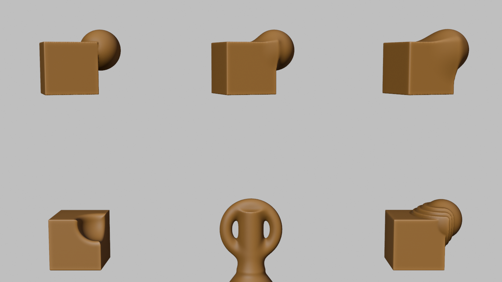
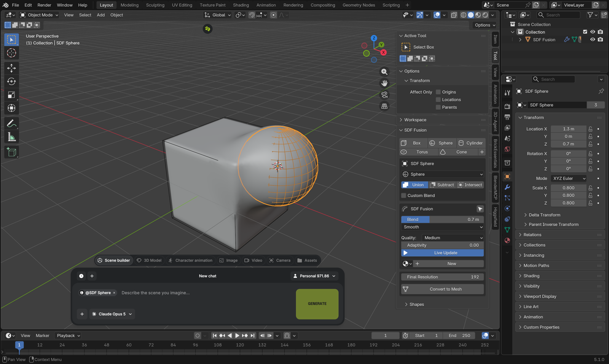
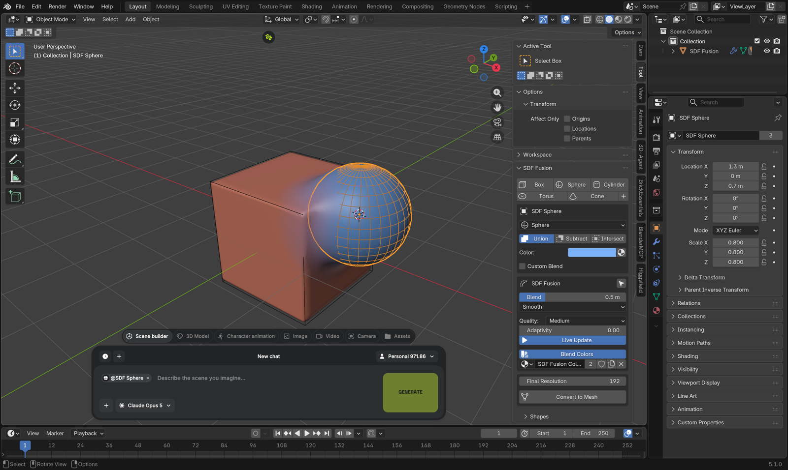
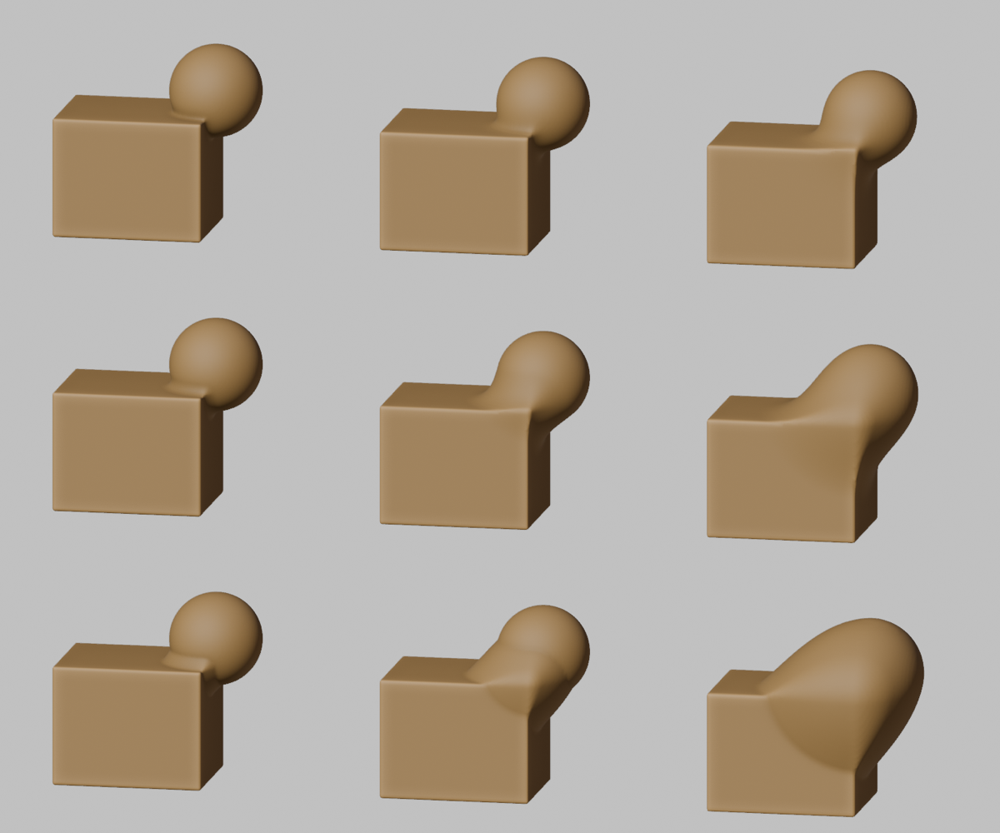

# SDF Fusion (Blender 5.x)

Smooth, non-destructive SDF modelling for Blender 5.0+: add a box, add a
sphere, overlap them, drag one **Blend** slider and watch them melt together.
The result is a live mesh that updates while you move, rotate or scale the
source shapes, and it bakes to a normal Blender mesh with one click.

This is a Blender 5 port and redesign of the MIT licensed
[Mesh from SDF](https://github.com/TLabAltoh/mesh_from_sdf) add-on by
TLabAltoh.  The original evaluated its distance field with OpenGL 4.3 compute
shaders through ModernGL, which does not exist on macOS / Metal; the port
compiles the very same distance-field maths into a Geometry Nodes tree that
Blender evaluates natively on every platform.  See
[docs/PORTING_NOTES.md](docs/PORTING_NOTES.md) for the full record.







## Requirements

* Blender 5.0 or newer (developed against 5.1, targeted at 5.2 LTS)
* Any platform Blender runs on: no GPU compute, no extra Python packages.
  Tested on macOS / Apple Silicon.

## Installation

1. Download `sdf_fusion-1.13.0.zip` (or build it, see below).
2. Drag and drop the ZIP into a Blender window, or use
   *Edit > Preferences > Get Extensions > (dropdown) > Install from Disk...*
3. Enable **SDF Fusion** if it is not enabled automatically.
4. In the 3D Viewport press **N** and open the **SDF Fusion** tab (shapes are
   also in **Shift+A > SDF Fusion**).

To build the ZIP yourself:

```bash
/Applications/Blender.app/Contents/MacOS/Blender -b --command extension build --source-dir . --output-dir dist
```

## Usage

Everything is also where Blender users expect it: the **Object** tab of the
Properties editor shows a shape's SDF settings (or a fusion's), the
**Modifier** tab of a fusion shows its settings above the modifier stack,
shapes are in **Shift+A > SDF Fusion**, and the object right-click menu has an
**SDF Fusion** entry.  The sidebar tab gathers it all in one place:

```
SDF Fusion
  [ Box ] [ Sphere ] [ Cylinder ]
  [ Torus ] [ Cone ] [ Capsule ]
  [ Pyramid ] [ Prism ] [ Mesh ]
  [ Use Selected Objects ] [+]

  <active shape>
    Primitive      Box / Sphere / Cylinder / Torus / Cone / Capsule / Pyramid / Prism / Mesh (editable)
    Make Editable  turn a primitive into an editable mesh shape
    Operation      Union | Subtract | Intersect
    Radius         how far this shape's blend reaches
    Blend          how much the ramp fills in (1 = full quarter-pipe)
    Color          shape colour (see Materials)
    Size           X / Y / Z in scene units (edits the object scale)
    Sides          (prism)   Round Edges (box, cylinder, prism)
  Shape Material   (sub-panel) metallic, roughness, transmission, IOR,
                   emission, or "Use Shape Material" to follow a real material

  <fusion>
    Radius x       master multiplier for every shape's Radius
    Blend x        master multiplier for every shape's Blend
    Blend Mode     Ramp / Steps / Flat Bevel
    Mesh Detail    resolution of mesh shapes' fields (shown when a mesh shape exists)
    Mirror X Y Z   reflect the whole fusion across its own axes (model one half)
    Hollow         keep only a wall of this thickness (0 = solid)
    Quality        Low / Medium / High / Custom     (preview resolution)
    Smart Topology polygons only where the surface curves (flat = few, seams = dense)
    Live Update    pause the live mesh on heavy scenes
    Shading        Exact (normals from the field) / Auto Smooth / Smooth / Flat
    Blend Materials  per-shape colour and surface values that cross-fade
    Material         the fusion's material
    (duplicate icon) copy the fusion with all its shapes

  Final Resolution
  [ Convert to Mesh ]
```

1. Click **Box**.  A fusion object ("SDF Fusion") is created at the 3D cursor
   together with a wireframe **SDF Box** source shape, and the fused mesh
   appears immediately.
2. Move the 3D cursor (or just move the new shape afterwards), click
   **Sphere**, and drag the sphere so it overlaps the box.
3. With a shape selected, drag its **Radius** and **Blend**: the shapes melt
   into each other.  *Radius* sets how far from the seam the blend reaches
   along and into the neighbouring surfaces.  *Blend* sets how much the ramp
   fills in: 1.0 is a full circular quarter-pipe, lower values hug the inner
   corner, 0 is a sharp seam.  The ramp always curves inward and leaves both
   surfaces tangentially, so it never looks like it bulges; the quarter-pipe
   is the fullest it gets.  A small Radius with full Blend reads as a tight
   rounded bevel, a large Radius with a low Blend as a long, gentle lean.
   Every shape has its own values; **Radius x** and **Blend x** on the fusion
   scale all of them at once (Radius x = 0 gives hard booleans).  Where two
   shapes meet, the sharper setting wins by default, so one delicate shape
   can be tuned without touching the rest (*Seams* in the *Shapes*
   sub-panel).  *Blend Mode* also offers *Steps* and an explicit *Flat Bevel*.

   In the picture: columns are Radius 0.15 / 0.45 / 0.9, rows are Blend
   0.33 / 0.66 / 1.0.

   

4. Select a shape and set **Operation** to *Subtract* to carve it out of the
   result, or *Intersect* to keep only what lies inside it.  It does not
   matter which shape you pick: cutters are automatically applied after all
   Union shapes (*Cutters Last*, in the *Shapes* sub-panel; turn it off for
   strictly manual top-to-bottom ordering).  A cutter no longer contributes
   its own surface, so all you see of it is its guide outline.
5. Scale a shape with **S** to change its size: a box's scale is its half
   extents, a sphere's scale is its radius, a cylinder's XY scale is its
   radius and its Z scale its half height.  Rotation and location work as
   for any object.  The result follows live.
6. Set **Quality** low while modelling large scenes, then set **Final
   Resolution** and click **Convert to Mesh**.  With **Precise Edges** on
   (default) every baked vertex is projected onto the exact surface and
   crease vertices are pulled onto the true edge line, so hard edges of
   primitives come out perfectly straight instead of stair-stepped.  A new, ordinary mesh object
   is created at the final resolution; the fusion setup is hidden but kept
   so you can keep editing and convert again.

### Editable and imported meshes

Primitives are exact formulas, so their guide meshes are not meant to be
edited.  When you want real vertex editing, use a **Mesh** shape instead:

* **Mesh** (button) adds an editable cube shape.  Select it, press **Tab**,
  loop cut, extrude, move vertices, or sculpt it: the fusion follows live.
* **Use Selected Objects** turns any selected mesh objects (imported models,
  things you modelled) into shapes of the active fusion, keeping their
  position.  They keep their own mesh data and stay fully editable.
* Primitives are exact formulas, so their guide mesh is only a guide.  The
  moment you edit a primitive's vertices (Tab, then move, loop cut, scale a
  cap...) it turns into a mesh shape automatically and the fusion follows;
  set its Primitive back to restore the exact formula.  **Make Editable**
  does the same explicitly.
* **Release from Fusion** hands a mesh shape back as an ordinary object.

Mesh shapes are converted to a distance field by Blender's own *Mesh to SDF
Grid* node, so they blend, subtract and colour exactly like primitives.  Two
things to know: the mesh should be **closed** (every edge shared by two
faces), or the field is unreliable and the panel warns; and mesh fields are
voxel based, so **Mesh Detail** in the fusion box raises their resolution
when you need crisper edges (at some cost in speed).  Because the geometry
is used as is, Apply Scale / Rotation on a mesh shape is simply allowed.

### Why edges can look wavy, and what fixes it

The live mesh is extracted from a voxel grid, so a sharp crease is a tiny
staircase (up to half a voxel).  What you *see*, though, is mostly shading:
smooth shading turns the staircase into wavy bands, angle-based sharp
edges turn it into a saw-tooth.  **Shading: Exact** (default) takes the
normals from the distance field itself, so flat faces shade perfectly flat
and creases stay crisp at any Quality; only the silhouette still shows the
grid at low Quality.  Higher **Quality** shrinks the steps, and **Precise
Edges** on Convert makes hard edges exactly straight.  Mesh shapes are
limited by their own voxel field: raise **Mesh Detail** (the precise bake
samples them four times finer automatically).

### Modifiers without converting

The fusion is a real mesh object, so any Blender modifier added to it
post-processes the fused mesh live, and **Convert to Mesh** bakes it.  The
**Modifiers** sub-panel adds common ones (Twist / Bend, Smooth,
Subdivision, Remesh, Displace, Decimate, Solidify, Array); adding one
selects the fusion object and opens its **Modifier tab**, which is where you
edit the modifier with Blender's normal UI.  Note the modifiers belong to
the fusion object, not to the shape you happened to have selected.  The SDF
Fusion modifier is always kept first.  Modifiers on a *Mesh* shape
feed that shape's field instead (a Subdivision on an imported object smooths
its distance field).

### Materials

The fused result is one mesh, so it cannot carry one material per source
shape.  Instead every shape carries its own surface values: **Color** (in the
shape box) plus metallic, roughness, transmission, IOR and emission in the
**Shape Material** sub-panel.  Turn on **Use Shape Material** there to have
those values follow the Principled BSDF of the shape's own material
automatically, so you can keep working with real materials per shape.

Turn on **Blend Materials** in the fusion box: all values are mixed with the
same factor as the distances, so they cross-fade over the blend width exactly
where the surfaces melt, a hard union switches sharply at the seam, and a
subtraction paints the cut with the cutter's surface.  The result is stored
on the mesh as attributes (`Color`, `SDF Surface`, `SDF Extra`,
`SDF Emission`); the add-on assigns a generated "SDF Fusion Material" that
feeds them into a Principled BSDF, and switches Solid-mode viewports to
*Color: Attribute*.  Material Preview or Rendered shading shows the full
metallic / roughness / transmission / emission blend.  To use your own
material, read those attributes with *Color Attribute* / *Attribute* nodes,
or click **Use Color Material**.  Convert to Mesh keeps the attributes and the
material.

### Animation, Apply Transform, duplicates

* Every setting (Blend, colours, surface values, rounding...) can be
  keyframed or driven; the node tree follows through drivers.
* Applying scale, rotation or location to a shape (Ctrl+A) is detected and
  folded back into the object, so the fused result does not change.
* The duplicate icon next to the fusion name copies a fusion with all its
  shapes.  Shift+D on a fusion together with its shapes also works: the copy
  gets its own node tree automatically.
* After **Convert to Mesh** the setup is hidden in the viewport *and* in
  renders; **Show Fusion Setup** brings it back.

Tips

* The fusion object is a normal mesh object with a Geometry Nodes modifier,
  so you can move or parent the whole fusion, add materials, or stack more
  modifiers (Remesh, Smooth, Decimate) on top.
* Set a shape's **Radius** to 0 for a hard cut while the rest blends.
* Deleting a source shape with **X** removes it from the fusion automatically,
  and **Shift+D** on a shape adds the copy to the same fusion.
* Source shapes are drawn as light **Guides** (bounds outlines) so they do not
  hide the fused surface; switch *Guides* to *Wire* in the fusion box if you
  prefer wireframes.  Shapes can also be selected from the *Shapes* list.
* The *Shapes* sub-panel has a rebuild button if a tree ever gets out of sync
  (for example after appending objects from another file).

## Updating without restarting Blender

Install the new ZIP (Preferences > Get Extensions > Install from Disk) or let
the add-on be updated on disk, then run this in Blender's Python console
(Scripting workspace):

```python
import bpy, sys
m = 'bl_ext.user_default.sdf_fusion'
bpy.ops.preferences.addon_disable(module=m)
for k in [k for k in sys.modules if k == m or k.startswith(m + '.')]:
    del sys.modules[k]
bpy.ops.preferences.addon_enable(module=m)
```

Existing fusions keep working; click the rebuild icon in the *Shapes*
sub-panel (or change any setting) to rebuild them with the new version.

## Testing

The repository ships a headless test-suite that checks every primitive,
operation and blend type against a numpy reference implementation of the
original GLSL, and walks the full acceptance flow:

```bash
/Applications/Blender.app/Contents/MacOS/Blender -b --python tests/run_tests.py
```

See [docs/MANUAL_TESTING.md](docs/MANUAL_TESTING.md) for what still needs
to be checked by hand in the Blender UI.

## License

MIT, see [LICENSE.md](LICENSE.md).  Copyright (c) 2025 TLabAltoh (original
Mesh from SDF), (c) 2026 Martin Sap (Blender 5 port).
